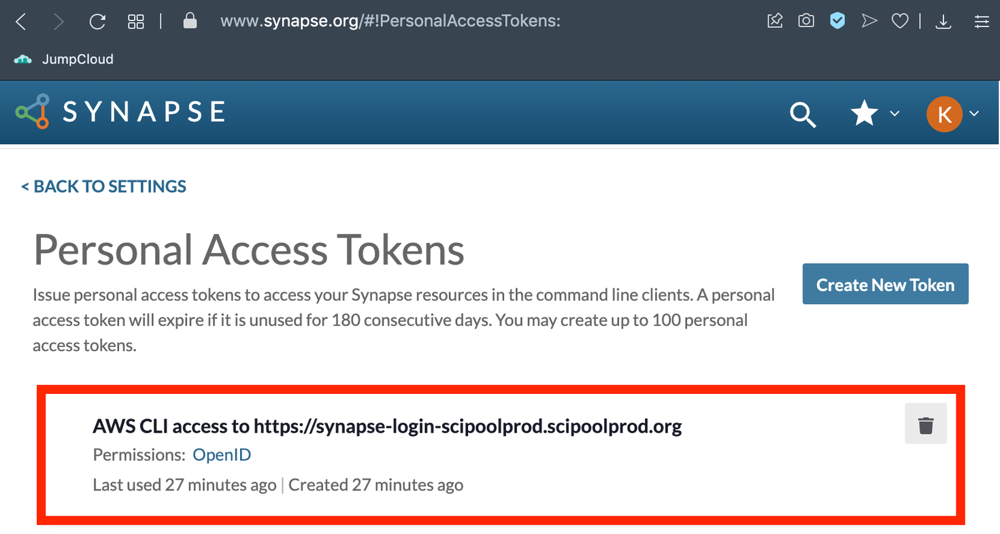
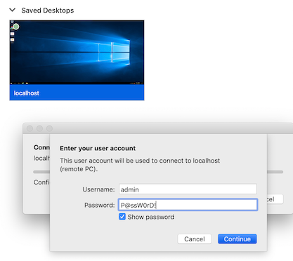

# service-catalog-docs
Documentation for the Sage Service Catalog

# Connecting to an Instance
A new instance takes a few minutes to be created.  Once complete, it will appear in the “Provisioned Products” list, showing status Available.  Select “Provisioned Product Details” from the navigation panel on the left, and click on your product. A product that has a “Succeeded” event will have outputs that include links for connecting.

* **ConnectionURI:** if your product has a ConnectionURI link, this will open a shell prompt in a browser tab. When you are done with your session click “Terminate” in the upper right corner.
* **NotebookConnectionURI:** Notebook products contain a NotebookConnectionURI link, which will open a notebook in the browser.
* **ConnectionInstructions:** For Windows products, click on the ConnectionInstructions link and follow the steps provided there.


## Create a Synapse personal access token
The AWS SSM allows direct access to private instances from your own computer terminal.  To setup access with the AWS SSM we need to create a special Synapse personal access token (PAT) that will work with the Sage Service Catalog.  This is special PAT that can only be created using this workflow, creating a PAT from the Synapse personal token manager web page will **NOT** work.

1. Request a Synapse PAT by opening https://sc.sageit.org/personalaccesstoken  (You may need to login to Synapse).  If you have already created a PAT through this mechanism and are repeating the process you must first visit the token management page in Synapse and delete the existing one with the same name.
2. After logging into Synapse a file containing the PAT, which is a long character string (i.e.  eyJ0eXAiOiJ...Z8t9Eg),  is returned to you.  Save the file to your local machine and note the location where you saved it to then close the browser session.

**Note:** At this point you can verify that the PAT for the Service Catalog was successfully created by viewing the Synapse token management page.  When the PAT expires you will need to repeat these steps to create a new PAT.  The PAT should look something like this




## SSM access to an Instance
To setup access the AWS EC2 instances with the AWS SSM we need to install the AWS CLI and make it source credentials with an external process.

1. Install the AWS CLI version 2 (SSM access will not work with ver 1.x)
2. Install SSM session manager plugin 

**Note:** You may execute the provided install_aws_cli.sh script to install these components.  There is a [linux](linux/install_aws_cli.sh) and [windows](windows/install_aws_cli.sh) script.   

3. Create a [linux synapse_creds.sh](linux/synapse_creds.sh) or [windows synapse.bat](windows/synapse_creds.bat) script 
   to source your synapse credentials.
   
4. Add the following to your ~/.aws/config file, replacing <PERSONAL_ACCESS_TOKEN> with the PAT you downloaded 
   then set the /absolute/path/to/synapse_creds.sh to the location of the synapse_creds.sh or synapse_creds.bat file.

```properties
[profile service-catalog]
region=us-east-1
credential_process = "/absolute/path/to/synapse_creds.sh" "https://sc.sageit.org" "<PERSONAL_ACCESS_TOKEN>"
```

**Note:** You may execute the provided setup-credentials-process script to configure your AWS CLI configurations for
SSM sessions.  There is a [linux](linux/setup-credentials-process.sh) or
[windows](windows/setup-credentials-process.bat) script.   


5. Goto the service catalog provisioned product page → click on your provisioned instance → get instance ID.

Run the SSM start-session command to access the instance.

**Note:** Windows users should do this in the command prompt.  In the following example the ID from the previous
step is i-0fd5c9ff0ef675ceb.

```shell
aws ssm start-session --profile service-catalog
                      --target i-0fd5c9ff0ef675ceb
                      --document-name AWS-StartInteractiveCommand
                      --parameters command="sudo su - ec2-user"

Starting session with SessionId: 3377358-0cab70190f97fcf78
[ec2-user@ip-10-41-23-76 ~]$
```

## Debugging Access

* If you encounter errors try running the AWS start-session command with the --debug option.
* If you use an invalid personal access token you will get an error similar to this

```shell

➜ aws ssm start-session --profile service-catalog
                        --target i-0fd5c9ff0ef675ceb

Expecting value: line 1 column 1 (char 0)
```
* To check whether your token is valid run the following command

```shell
➜ curl -I --location-trusted
      -H Authorization:"Bearer ${SYNAPSE_PAT}" https://sc.sageit.org/ststoken
```
If the HTTP response status is 2xx then the PAT is valid. If the PAT is invalid the response will be 4xx

* If you continue to have similar errors to `Expecting value: line X column X (char X)` then it could mean
that your synapse_creds.sh file is invalid.  Try verifying your synapse_creds.sh script independently
of the AWS command by executing just the script.  A successful execution should return a valid json and
look something like this:

```shell
➜ ~/synapse_creds.sh "https://sc.sageit.org" "eyJ0eXAiO...2GLQg"
{"SessionToken":"FwoGZXIvYXdzEN7//////////wEaDP2imuwAK+...13GnBrJc9SlOW6uY=","Version":1,"AccessKeyId":"XXXXXXX","SecretAccessKey":"XXXXXXXXXXXXXXXX","Expiration":"2021-07-21T22:02:17Z"}
```

* Another problem could be that your ~/.aws/config file is invalid.  For debugging we recommend backing
  up your current config file and creating a new one with just one service-catalog profile in it and then
  try re-running the start-session command.

## SSM access with custom commands
By default the ssm start command starts a session with the SSM-SessionManagerRunShell document which will login you in as the ssm-user with an sh shell.  If you prefer to start your session with a ‘bash’ shell then you can use the AWS-StartInteractiveCommand document.

```shell
aws ssm start-session --profile service-catalog
                      --target i-0fd5c9ff0ef675ceb
                      --document-name AWS-StartInteractiveCommand
                      --parameters command="bash -l"  
```

Or if you want to start your session with the ec2-user then you can do run this

```shell
aws ssm start-session --profile service-catalog
                      --target i-0fd5c9ff0ef675ceb
                      --document-name AWS-StartInteractiveCommand
                      --parameters command="sudo su - ec2-user"  
```

## SSM with SSH
You can use the AWS Command Line Interface (AWS CLI) to establish Secure Shell (SSH) connections to instances using AWS Systems Manager Session Manager. Users who connect using SSH can copy files between their local machines and the EC2 instance using Secure Copy Protocol (SCP).

### Setting SSH connection with ec2-user:  

1. Use the ssm start-session command to connect to the instance 

```shell
aws ssm start-session --profile service-catalog
                      --target i-0fd5c9ff0ef675ceb
                      --document-name AWS-StartInteractiveCommand
                      --parameters command="sudo su - ec2-user"  
```

2. Copy the public portion of your ssh key (on your local computer) to the instance’s ~/.ssh/authorizedkeys file.
3. Set the permission of the authorizedkeys file to 600 (i.e. chmod 600 ~/.ssh/authorizedkeys)
4. Add the following to your local machine’s ~/.ssh/config file 

```properties
# SSH over Session Manager
host i-* mi-*
    ProxyCommand sh -c "aws ssm start-session --target %h --document-name AWS-StartSSHSession --parameters 'portNumber=%p'"
```
5. From your local machine, execute the ssh command to access the instance

```shell
➜ AWS_PROFILE=service-catalog ssh -i ~/.ssh/id_rsa ec2-user@i-0fd5c9ff0ef675ceb
Last login: Thu Jun 17 21:25:56 2021

       __|  __|_  )
       _|  (     /   Amazon Linux 2 AMI
      ___|\___|___|

https://aws.amazon.com/amazon-linux-2/
[ec2-user@ip-10-41-23-76 ~]$
```

6. From your local machine, execute the scp command to copy files directly to the instance 
```shell
➜ AWS_PROFILE=service-catalog scp -i ~/.ssh/id_rsa README.md ec2-user@i-07eeb59282fafe244:~/.
README.md                                             100%  814     9.2KB/s   00:00
```

## SSM access to applications
When running apps in the instance you may want to run the apps on specific ports.  The AWS SSM allows you to expose those ports to your local computer using a technique called port forwarding.  Here’s an example of how to enable port forwarding to an application.

### Setup profile for SSM access

1. Run an application on the EC2 (i.e. docker run -p 80:80 httpd)
```shell
[ec2-user@ip-10-49-26-50 ~]$ docker run -p 80:80 httpd
Unable to find image 'httpd:latest' locally
latest: Pulling from library/httpd
33847f680f63: Pull complete
d74938eee980: Pull complete
963cfdce5a0c: Pull complete
8d5a3cca778c: Pull complete
e06a573b193b: Pull complete
Digest: sha256:71a3a8e0572f18a6ce71b9bac7298d07e151e4a1b562d399779b86fef7cf580c
Status: Downloaded newer image for httpd:latest
AH00558: httpd: Could not reliably determine the server's fully qualified domain name, using 172.17.0.2. Set the 'ServerName' directive globally to suppress this message
AH00558: httpd: Could not reliably determine the server's fully qualified domain name, using 172.17.0.2. Set the 'ServerName' directive globally to suppress this message
[Thu Jul 22 23:54:12.106344 2021] [mpm_event:notice] [pid 1:tid 140706544895104] AH00489: Apache/2.4.48 (Unix) configured -- resuming normal operations
[Thu Jul 22 23:54:12.107307 2021] [core:notice] [pid 1:tid 140706544895104] AH00094: Command line: 'httpd -D FOREGROUND'
```

2. To provide access to that app an SC user can use the port forwarding feature to gain access to the app by running the AWS SSM CLI command

```shell
aws ssm start-session --profile service-catalog
                      --target i-0fd5c9ff0ef675ceb
                      --document-name AWS-StartPortForwardingSession
                      --parameters '{"portNumber":["80"],"localPortNumber":["9090"]}'
Now you should be able to access that app on your local machine at http://localhost:9090 
```

## Connecting to Windows Instances

### Connect to Windows shell
Connecting to the Windows instance’s shell is similar to accessing a linux instance’s shell.  Just follow instructions in SSM access to an Instance.

### Connect to Windows desktop
1. Connecting to the Windows desktop requires a few more steps.
2. Connect to the Windows shell.
3. Create a new user and and it to the “Administrators” group

```shell
$Password = ConvertTo-SecureString "P@ssW0rD!" -AsPlainText -Force
New-LocalUser "admin" -Password $Password
Add-LocalGroupMember -Group "Administrators" -Member "admin"
```

4. Follow the SSM access to applications instructions to setup port forwarding to windows RDP

```shell
aws ssm start-session --profile service-catalog
                      --target i-0fd5c9ff0ef675ceb
                      --document-name AWS-StartPortForwardingSession
                      --parameters '{"portNumber":["3389"],"localPortNumber":["3389"]}'
```

5. Install the Microsoft Remote Desktop client on your computer.
6. Click “+” to add a new PC. In the “PC Name” field, enter “localhost”. 
7. Log in with username “admin” and password "P@ssW0rD!"

